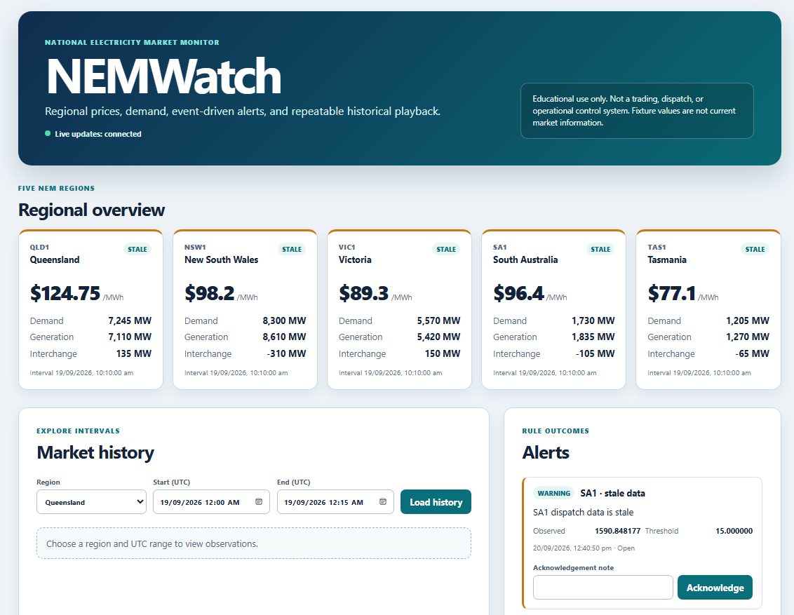
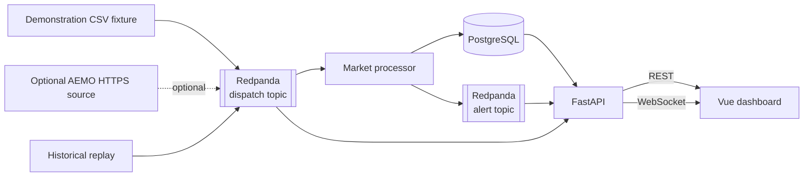

# NEMWatch

> **Educational use only.** NEMWatch is not a trading, dispatch, or operational control system. The checked-in fixture is deterministic demonstration data, not current market information.

NEMWatch is a local, event-driven monitor for public Australian National Electricity Market data. It parses an attributed fixture, publishes versioned events through Redpanda, persists idempotently in PostgreSQL, evaluates operational alert rules, streams updates to an accessible Vue dashboard, and replays history through the same pipeline.



## Run the demonstration

Prerequisites are Git, Docker Desktop with Linux containers, and at least 4 GB of Docker memory. Host Python, Node, Vue, PostgreSQL, and Redpanda installations are not required.

```powershell
Copy-Item .env.example .env
make demo
```

Open http://localhost:5173, start a fast replay, inspect the high-price and rapid-demand alerts, acknowledge one with a note, and open Grafana to inspect the resulting service behavior. See [the five-minute walkthrough](docs/demo.md) for exact steps.

## What it demonstrates

- Five-region overview with exact price, demand, generation, interchange, interval, and freshness states.
- Accessible price history with equivalent SVG chart and data table.
- High-price, rapid-demand-change, and stale-data alerts with durable acknowledgement notes.
- Adjustable historical replay with filters, progress, cancellation, and one-active-job enforcement.
- Versioned `DispatchObservedV1` and `AlertRaisedV1` events through Redpanda.
- PostgreSQL uniqueness constraints and upserts for at-least-once idempotency.
- REST, OpenAPI, WebSocket updates, correlation IDs, structured JSON logs, and Prometheus metrics.
- Provisioned Prometheus and Grafana plus dependency-aware readiness.

## Event flow



Replay publishes to the normal dispatch topic. The processor commits a consumed offset only after the database transaction succeeds. Regional intervals and alert idempotency keys remain unique when delivery is repeated.

## Local URLs

| Service | URL |
| --- | --- |
| Dashboard | http://localhost:5173 |
| OpenAPI | http://localhost:8000/docs |
| Liveness | http://localhost:8000/health/live |
| Readiness | http://localhost:8000/health/ready |
| Metrics | http://localhost:8000/metrics |
| Prometheus | http://localhost:9090 |
| Grafana | http://localhost:3000 |
| Redpanda admin | http://localhost:9644 |

Grafana credentials come from `.env`. The values in `.env.example` are development-only and are not production-safe.

## Useful commands

```powershell
make up              # Build and start services
make migrate         # Apply PostgreSQL migrations
make ingest          # Publish the deterministic fixture
make demo            # Run all three steps and print URLs
make verify          # Run the consolidated backend, frontend, and browser suite
make logs            # Read recent service logs
make down            # Stop services and preserve volumes
```

## API surface

- `GET /api/v1/regions`
- `GET /api/v1/dispatch/latest`
- `GET /api/v1/dispatch/history`
- `GET /api/v1/alerts`
- `POST /api/v1/alerts/{id}/acknowledge`
- `POST /api/v1/replays`
- `GET /api/v1/replays/{id}`
- `DELETE /api/v1/replays/{id}`
- `WS /ws/market`

## Documentation

- [Architecture and reliability](docs/architecture.md)
- [Data source and attribution](docs/data-source.md)
- [Demonstration walkthrough](docs/demo.md)
- [Trade-offs and limits](docs/tradeoffs.md)
- [Observability](observability/README.md)
- [Learning log](LEARNING_LOG.md)

The local MVP deliberately excludes identity, multi-tenancy, trading automation, AWS, Kubernetes, Terraform, and paid infrastructure.
