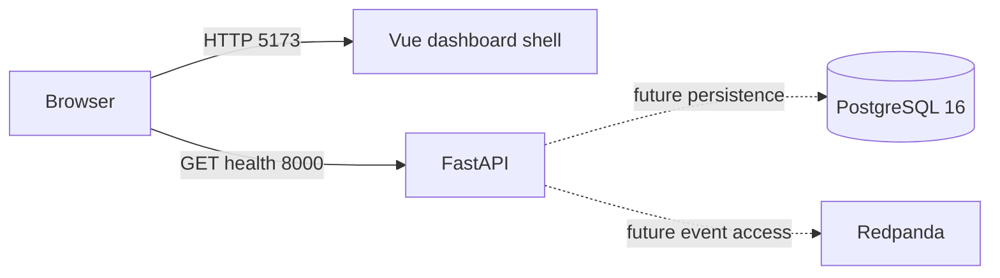

# Milestone 1 Repository and Local Runtime Design

**Status:** Approved  
**Date:** 2026-09-19  
**Milestone:** 1 of 10  
**Source brief:** NEMWatch Project Guide and Codex Build Specification

## Purpose

Milestone 1 creates the smallest complete local foundation for NEMWatch. A clean clone will start a FastAPI process, a Vue dashboard shell, PostgreSQL, and a single-node Redpanda broker through Docker Compose. The milestone proves that the chosen toolchain and service boundaries work together on the development computer without cloud credentials or paid infrastructure.

The result is deliberately a walking skeleton. It establishes packaging, configuration, health reporting, container networking, developer commands, documentation, and test conventions. It does not yet model market data or pretend that unfinished services contain working ingestion, persistence, or streaming behaviour.

## Intended outcome

After this milestone, Stephen can clone the repository, copy the sample environment file, run one Docker Compose command, open the dashboard shell, and receive a successful API liveness response. PostgreSQL and Redpanda will report healthy through Docker Compose. The repository will explain what each service is for and which capabilities arrive in later milestones.

Success means all of the following are true:

- `docker compose up --build -d` starts the four required services from a clean clone.
- `GET http://localhost:8000/health/live` returns HTTP 200 with the documented JSON body.
- The dashboard shell is available at `http://localhost:5173` and clearly identifies itself as an educational NEM monitoring project.
- PostgreSQL and Redpanda reach healthy status without manual setup.
- Backend and frontend smoke tests pass inside their reproducible toolchains.
- No AWS credentials, cloud resources, live AEMO connection, or paid service is required.

## Project constraints

- The backend language is Python 3.13.
- The API framework is FastAPI with Pydantic 2.
- The frontend is Vue 3 with TypeScript and Vite.
- PostgreSQL 16 is the database runtime.
- Redpanda supplies a local Kafka-compatible broker.
- Docker Compose is the required local runtime and the canonical clean-clone path.
- Container images and application dependencies use explicit version tags or lockfiles; `latest` tags are not permitted.
- Local configuration comes from environment variables with safe development values in `.env.example`.
- `.env`, credentials, generated build output, caches, and local database data are excluded from Git.
- All timestamps introduced by the project will be timezone-aware and represented in UTC, although Milestone 1 does not yet persist timestamps.
- AWS deployment, Terraform execution, Kubernetes, live AEMO ingestion, and production authentication are outside this milestone.
- Each completed checkpoint receives a focused Git commit. Commit subjects include the milestone number and describe the delivered capability, while commit bodies summarise the change and its verification.

## Architecture decision

Milestone 1 uses a container-first monorepo. Developers may run individual tools locally later, but the required path does not depend on a host Python installation, `uv`, PostgreSQL, or Redpanda. This is important because the current Windows environment has Docker and Node available but does not expose a host Python launcher or `uv` command.

The repository creates the final service boundaries early without implementing future behaviour prematurely:



The dotted connections document future dependencies. In Milestone 1 the API liveness route must not query PostgreSQL or Redpanda. Liveness answers only whether the API process can serve requests. Dependency-aware readiness is added when the application starts using those services.

## Runtime components

### API service

The `api` service runs Python 3.13, installs the backend from its locked project metadata, and starts FastAPI through Uvicorn. It owns only application configuration and the liveness endpoint in this milestone.

The application factory and route module remain separate so later API routes do not accumulate in one file. Configuration is parsed through a Pydantic settings object, but the liveness handler has no database or broker dependency.

### Frontend service

The `frontend` service runs the Vue development server inside a pinned Node container and listens on all container interfaces. Vite exposes the application on host port 5173.

The initial screen contains:

- Product name: `NEMWatch`
- Description: `Australian National Electricity Market monitoring and alerting`
- State label: `Local development shell`
- Disclaimer: `Educational use only. Not a trading, dispatch, or operational control system.`

The shell uses semantic `main` and heading elements, readable contrast, visible keyboard focus, and no chart placeholder that could be mistaken for real market data.

### PostgreSQL service

The `postgres` service uses PostgreSQL 16 with a named development volume. Its database name, user, and password come from `.env`. The checked-in example values are local-only values and are never described as production-safe.

Its Compose health check uses `pg_isready` with the configured database and user. No tables or migrations are created until Milestone 2.

### Redpanda service

The `redpanda` service runs one broker in documented development mode with a named volume. It advertises an internal listener for containers and a host listener for later diagnostic use. Its health check uses the broker's bundled `rpk` command.

No topics are created in Milestone 1. Topic naming, partitions, retention, and typed event contracts belong to Milestone 6.

## Repository structure

Milestone 1 creates the following tracked files. Directories reserved for later work contain short README files instead of empty placeholders.

```text
nemwatch/
  README.md
  AGENTS.md
  LEARNING_LOG.md
  .editorconfig
  .env.example
  .gitattributes
  .gitignore
  docker-compose.yml
  Makefile
  docs/
    architecture.md
    data-source.md
    decisions/
      0001-container-first-local-runtime.md
    superpowers/
      specs/
        2026-09-19-milestone-1-local-runtime-design.md
  backend/
    .dockerignore
    Dockerfile
    pyproject.toml
    uv.lock
    src/nemwatch/
      __init__.py
      config.py
      api/
        __init__.py
        health.py
        main.py
    tests/
      unit/api/test_health.py
  frontend/
    .dockerignore
    Dockerfile
    index.html
    package.json
    package-lock.json
    tsconfig.json
    vite.config.ts
    src/
      App.vue
      main.ts
      style.css
    tests/
      App.spec.ts
      setup.ts
  observability/
    README.md
  infra/
    README.md
```

### File responsibilities

- `README.md` provides the exact local start, stop, test, and URL instructions.
- `AGENTS.md` records repository-specific working rules, verification commands, milestone boundaries, and the prohibition on automatic cloud provisioning.
- `LEARNING_LOG.md` records the Milestone 1 lesson: liveness, readiness, and Compose health are different signals.
- `.editorconfig` and `.gitattributes` keep line endings and basic formatting consistent across Windows and Linux containers.
- `.env.example` documents every local environment variable with a non-secret development value.
- `docker-compose.yml` is the single source of truth for the required local topology.
- `Makefile` provides convenience targets while the README also gives direct Docker commands for Windows systems without `make`.
- `docs/architecture.md` records the complete intended local event flow and labels unimplemented parts.
- `docs/data-source.md` records the public-data-only rule and AEMO disclaimer; source-file details are added with the first fixture in Milestone 3.
- `docs/decisions/0001-container-first-local-runtime.md` explains why Docker Compose is the required path.
- `observability/README.md` and `infra/README.md` state the later milestones that own those areas and prevent premature configuration.

## External interfaces

### API liveness contract

```http
GET /health/live HTTP/1.1
Host: localhost:8000
```

Successful response:

```json
{
  "status": "ok",
  "service": "nemwatch-api"
}
```

The response has status 200 and content type `application/json`. It does not include build timestamps, hostnames, environment variables, dependency status, or other information that could leak operational details.

### Local ports

| Component | Host port | Purpose |
|---|---:|---|
| Vue | 5173 | Dashboard shell |
| FastAPI | 8000 | API and generated OpenAPI page |
| PostgreSQL | 5432 | Optional local database inspection |
| Redpanda Kafka listener | 19092 | Optional host-side broker inspection |
| Redpanda admin API | 9644 | Broker health and diagnostics |

Container-to-container connections use Compose service names rather than `localhost`.

## Configuration contract

`.env.example` contains these settings with local development values:

- `POSTGRES_DB`
- `POSTGRES_USER`
- `POSTGRES_PASSWORD`
- `DATABASE_URL`
- `KAFKA_BOOTSTRAP_SERVERS`
- `VITE_API_BASE_URL`
- `LOG_LEVEL`

The Compose file accepts environment overrides while producing a working local stack from the documented example file. The backend validates required configuration at startup and reports a concise setting name when configuration is missing. It never prints passwords or full connection strings.

## Startup and shutdown behaviour

The canonical startup sequence is:

```powershell
Copy-Item .env.example .env
docker compose config
docker compose up --build -d
docker compose ps
curl.exe http://localhost:8000/health/live
```

The canonical shutdown command is:

```powershell
docker compose down
```

Normal shutdown preserves named development volumes. Removing volumes is a separate explicit maintenance action and is not part of routine shutdown.

Compose waits for PostgreSQL and Redpanda health checks before marking dependent application startup complete. Health checks use bounded intervals, timeouts, and retries so a failed dependency becomes visible instead of hanging indefinitely.

## Error handling

- Invalid or missing required environment settings stop the affected application container with a clear, non-secret error.
- A PostgreSQL health failure leaves the service unhealthy and visible in `docker compose ps`.
- A Redpanda health failure leaves the broker unhealthy and visible in `docker compose ps`.
- The API liveness route remains deterministic and cannot fail because the database or broker is unavailable.
- The frontend displays only the static shell in this milestone, so it does not invent API, database, or market-data status.
- Container logs go to standard output and standard error. Structured JSON logging is introduced in Milestone 9.

## Security and data handling

- Only public, educational project information is committed.
- `.env` and common credential formats are ignored.
- Sample credentials are scoped to the local Compose network and labelled as development-only.
- Containers run with the minimum practical privileges supported by their base images.
- No source file, image, or documentation may contain previous-employer information.
- No AWS SDK configuration, cloud credential mounts, Terraform execution, or remote telemetry is added.
- The dashboard includes the AEMO educational-use disclaimer from its first screen.

## Testing strategy

### Backend test

An API test constructs the FastAPI application, requests `/health/live`, and asserts the exact status code and JSON body. This pins the public liveness contract without testing Uvicorn internals.

### Frontend test

A Vue component test renders `App.vue` and asserts the product heading and educational-use disclaimer are visible. The test verifies observable content rather than CSS implementation details.

### Configuration checks

- Backend dependency locking succeeds and `uv lock --check` reports no drift.
- Frontend dependency installation uses `npm ci` and the committed lockfile.
- `docker compose config` parses the complete local topology.
- Container builds fail on dependency or compilation errors.

### Runtime verification

The milestone review runs these checks from a clean working tree:

```powershell
docker compose config
docker compose up --build -d
docker compose ps
curl.exe --fail --show-error http://localhost:8000/health/live
docker compose run --rm api uv run pytest -v
docker compose run --rm frontend npm run test -- --run
docker compose run --rm frontend npm run build
```

The review confirms all four services are running, PostgreSQL and Redpanda are healthy, the API returns the exact contract, backend and frontend tests pass, and the frontend production build succeeds.

## Completion criteria

Milestone 1 is complete only when:

1. The repository contains the documented foundation and no unrelated feature code.
2. A clean clone starts with the documented Docker Compose commands.
3. PostgreSQL and Redpanda health checks pass.
4. The liveness API test and live HTTP request both pass.
5. The dashboard shell test and production build pass.
6. The dashboard is keyboard-readable and contains the educational-use disclaimer.
7. `LEARNING_LOG.md` explains liveness, readiness, and dependency health with examples from NEMWatch.
8. No secrets, cloud credentials, generated build output, or local volumes are tracked.
9. The observed command results are recorded in the milestone review entry.
10. The milestone is committed as a focused change before Milestone 2 begins.

## Deferred scope

The following work is intentionally deferred to the milestone that owns it:

- Domain models, SQLAlchemy, Alembic, tables, and repository methods: Milestone 2.
- AEMO fixtures, parsing, downloads, and rejected-row handling: Milestone 3.
- Business REST endpoints, pagination, and bounded history queries: Milestone 4.
- Dashboard data views, charts, typed API client, loading states, and error states: Milestone 5.
- Kafka topics, versioned event envelopes, producers, consumers, and offset strategy: Milestone 6.
- Alert rules, acknowledgements, and WebSocket updates: Milestone 7.
- Replay jobs, progress, cancellation, and concurrency rules: Milestone 8.
- Structured logs, Prometheus, Grafana, tracing, and resilience exercises: Milestone 9.
- GitHub Actions, Playwright, screenshots, and portfolio polish: Milestone 10.
- Terraform, AWS resources, Helm, kind, and Kubernetes: optional phases requiring separate approval after the local MVP.

## Risks and mitigations

| Risk | Mitigation |
|---|---|
| Docker behaves differently on Windows and Linux | Use Linux containers, explicit line-ending rules, and clean-clone Compose verification. |
| Floating images make builds change unexpectedly | Pin explicit image versions and commit dependency lockfiles. |
| Health checks imply functionality that does not exist | Label the UI as a shell and keep liveness separate from dependency readiness. |
| Local sample credentials are mistaken for production defaults | Label them development-only in `.env.example`, Compose, and README documentation. |
| Scaffolding grows into premature feature code | Enforce the deferred-scope list and require milestone review before continuing. |
| `make` is unavailable on the Windows host | Document direct Docker Compose commands as the canonical path; Make targets remain optional shortcuts. |

## Milestone review gate

After implementation, Codex will present the planned-versus-created file list, the exact verification commands, and the observed results. It will update `LEARNING_LOG.md`, create one focused Git commit whose subject includes the milestone number and whose body records the change and verification, and wait for Stephen's approval before starting Milestone 2.
